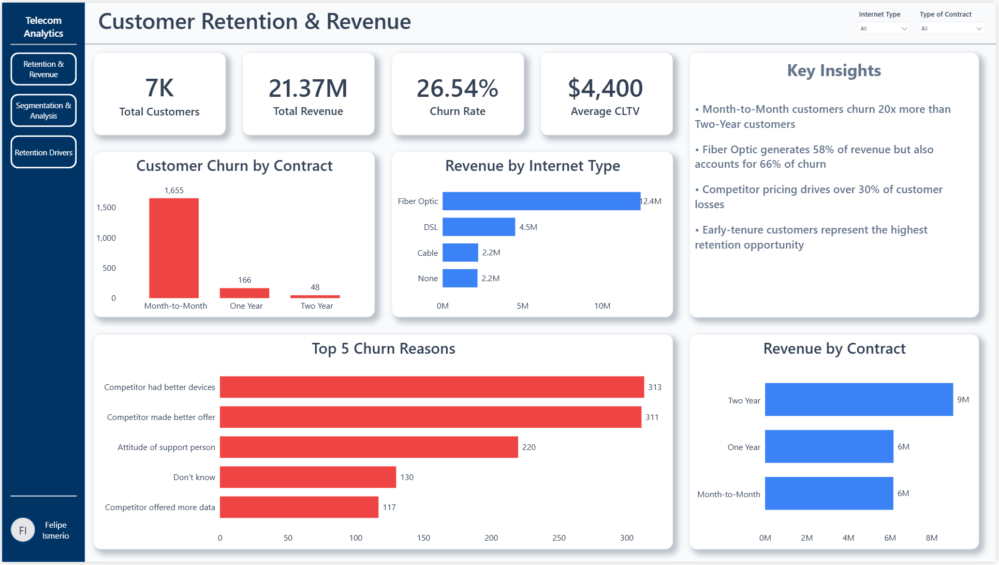
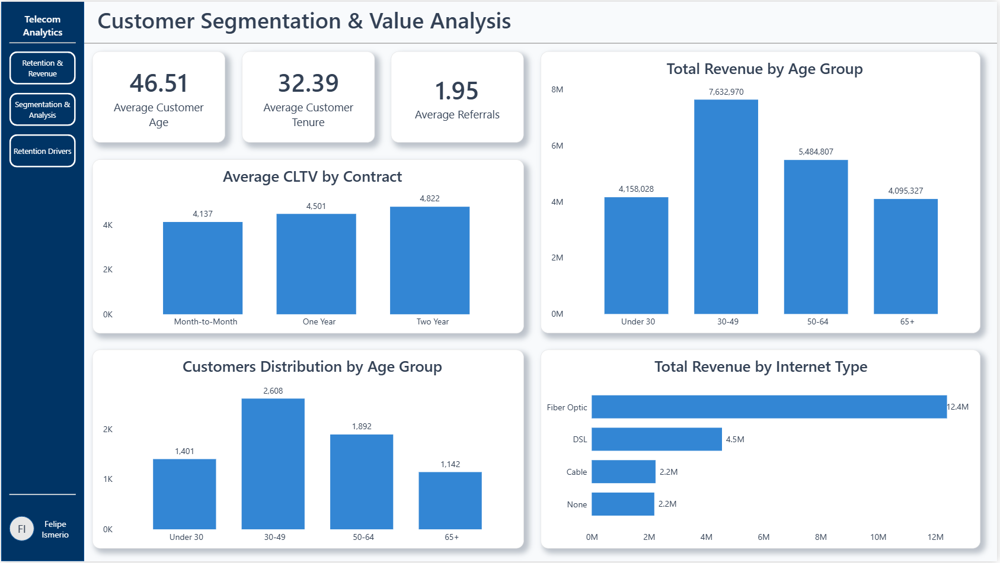
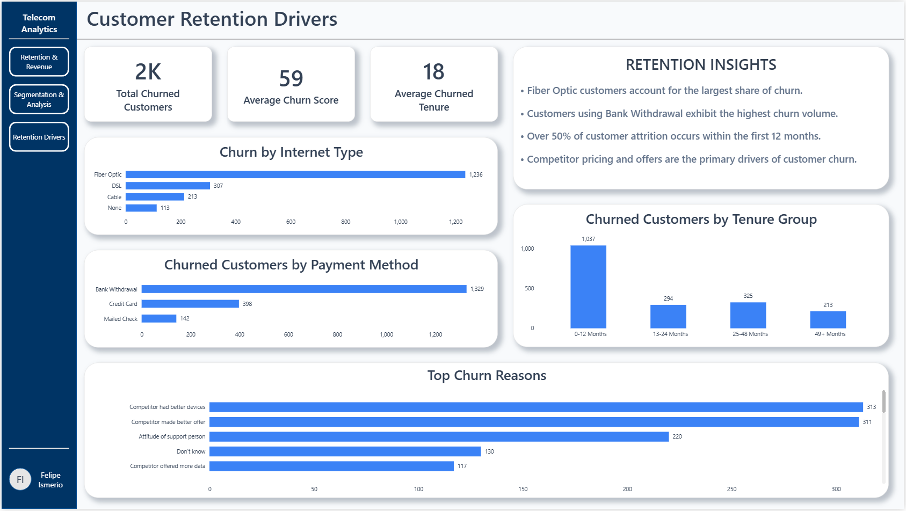

# Telecom Customer Churn Analysis Dashboard

## Project Overview

This project analyzes customer churn, revenue performance, customer lifetime value (CLTV), and retention trends for a telecommunications company using Power BI.

The dashboard was designed to identify key drivers of churn and provide actionable business insights to improve customer retention and revenue growth.

---

## Business Objectives

- Identify primary causes of customer churn
- Analyze customer lifetime value across contract types
- Evaluate revenue performance by customer segment
- Understand churn behavior by tenure, payment method, and service type

---

## Tools Used

- Power BI
- DAX
- Power Query
- Data Modeling

---

## Dashboard Pages

### Executive Dashboard

Key Metrics:
- Total Customers
- Total Revenue
- Average CLTV
- Churn Rate

Insights:
- Two Year contracts generated the highest revenue
- Month-to-Month contracts experienced the highest churn
- Fiber Optic customers generated the most revenue

---

### Customer Segmentation & Value Analysis

Insights:
- Two Year customers have the highest CLTV
- Customers aged 30-49 generate the most revenue
- Customer value varies significantly by contract type

---

### Retention & Churn Analysis

Insights:
- Over 50% of customer churn occurs within the first 12 months
- Bank Withdrawal customers exhibit the highest churn volume
- Competitor-related factors are the leading churn drivers

---

## Key Findings

1. Contract length strongly influences customer retention.
2. Fiber Optic customers generate substantial revenue but also contribute significantly to churn.
3. Early customer lifecycle stages represent the highest retention risk.
4. Competitor offers and pricing are the primary causes of customer attrition.

---

## Author

Created by Felipe Ismerio as part of a Business Intelligence and Data Analytics portfolio project.
